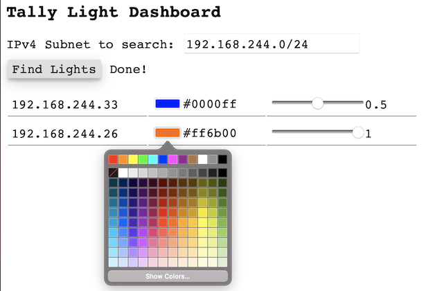
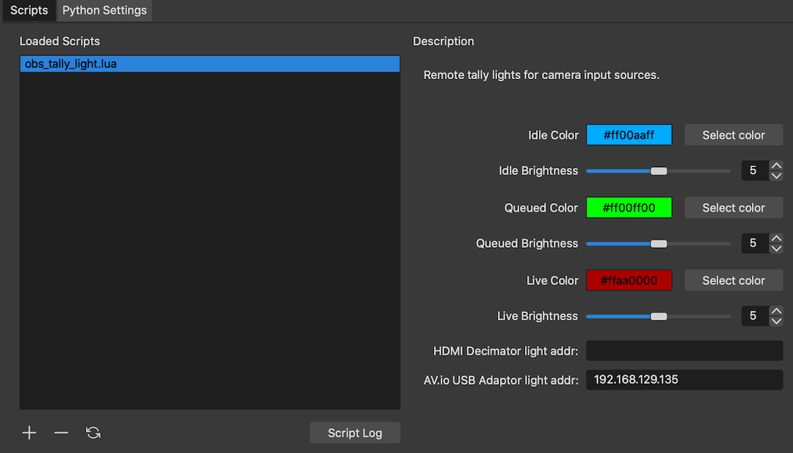

# TallyPi

A network controlled tally light for cameras, intended for control by OBS but
extensible enough to use for whatever purposes you like.

## Hardware

TallyPi is built for the
[Raspberry Pi](https://www.raspberrypi.org/products/raspberry-pi-zero-w/) and
a variety of LED breakout boards, including the
[Pimoroni Blinkt!](https://shop.pimoroni.com/products/blinkt) as well as the
the NeoPixel platform. The
[5x10 PixelLeaf RGB Matrix](https://www.tindie.com/products/oakdevtech/5x10-pixelleaf-rgb-matrix-sk6812mini-rgb-matrix/)
is the current breakout board validated for TallyPi.

TallyPi also supports hardware buttons/switches to shutdown the Pi and wake it back up.

Details on how to wire up the LED breakout boards, as well as details on how to
wire the on/off switch, are listed in [HARDWARE.md](./docs/HARDWARE.md).

There is also an enclosure supplied with TallyPi that can be 3D printed.
It's not great, but it works as a light diffuser and includes a mount for a
camera flash bracket. It is available from this repository
or via [Thingiverse](https://www.thingiverse.com/thing:4590885).

## The Tally Light API

A web service is provided to expose NeoPixels through an HTTP interface.
This controls color and brightness, and will monitor the on/off switch
(if available) to shut down the light in an orderly fashion.

An HTTP interface is provided that allows for color control and brightness
to be specified remotely. As an example:

    http://192.168.1.1:7413/set?color=AA22FF&brightness=0.3

Would set the NeoPixels to be purple across all LEDs, at 30% brightness.

The status of the LEDs are available as:

    http://192.168.1.1:7413/status

Details on installing the software, as well as protecting your Pi for
repeated use, is available within [INSTALLING.md](./docs/INSTALLING.md).

## Web Dashboard

A web dashboard is provided in [scripts/dashboard.html](./scripts/dashboard.html)
as a single HTML page that you can load directly in a browser - no server needed.
Enter in the IPv4 network you would like to search, and the page will quickly
crawl the network looking for API endpoints listening on port 7413. If it finds
any tally lights, it will display the IPv4 address, current color, and brightness
which can be changed directly in the dashboard.

## OBS Script

An OBS script in both [Python](./scripts/obs_tally_light.py) and
[Lua](./scripts/obs_tally_light.lua) is provided that maps
preview/program/idle status to AV input sources. You can chose the color
and brightness for the status of your input sources, and map each input source
to the IP address or hostname of your tally light web interface.

You must have installed the correct version of Python for OBS to properly load
Python plugins. Details for setting up OBS, installing the interface,
and configuring settings are available at [OBS.md](./docs/OBS.md).

If you are having trouble identifying your lights by hostname, you can use either
the [HTML dashboard page](./scripts/dashboard.html) or the
[scripts/find_lights.sh](./scripts/find_lights.sh) command-line script to search
your network for available lights. Either option will provide you with an IPv4
address for each light found which can be used to setup the OBS plugin.
