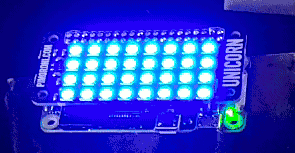

# TallyPi

A network controlled tally light for cameras, intended for control by
[TallyOBS](https://github.com/deckerego/tally_obs)
but extensible enough to use for whatever purposes you like.

## Hardware

TallyPi is built for the
[Raspberry Pi](https://www.raspberrypi.org/products/raspberry-pi-zero-w/) and
a variety of LED breakout boards, including the
[Pimoroni Blinkt!](https://shop.pimoroni.com/products/blinkt) as well as the
the NeoPixel platform. The
[5x10 PixelLeaf RGB Matrix](https://www.tindie.com/products/oakdevtech/5x10-pixelleaf-rgb-matrix-sk6812mini-rgb-matrix/)
is the current NeoPixel breakout board validated for TallyPi.

TallyPi also supports hardware buttons/switches to shutdown the Pi and wake it back up.

Details on how to wire up the LED breakout boards, as well as details on how to
wire the on/off switch, are listed in [HARDWARE.md](./docs/HARDWARE.md).

There is also an enclosure supplied with TallyPi that can be 3D printed.
It's not great, but it works as a light diffuser and includes a mount for a
camera flash bracket. It is available from this repository
or via [Thingiverse](https://www.thingiverse.com/thing:4590885).

## The Tally Light API

A web service is provided to expose NeoPixels through an HTTP interface.
This controls color and brightness, and will monitor the on/off switch
(if available) to shut down the light in an orderly fashion.

An HTTP interface is provided that allows for color control and brightness
to be specified remotely. As an example:

    http://192.168.1.1:7413/set?color=AA22FF&brightness=0.3

Would set the NeoPixels to be purple across all LEDs, at 30% brightness.

The status of the LEDs are available as:

    http://192.168.1.1:7413/status

If you would like to tweak an individual light, an HTML dashboard for 
controlling colors and brightness is available at:

    http://192.168.1.1:7413/dashboard

Details on installing the software, as well as protecting your Pi for
repeated use, is available within [INSTALLING.md](./docs/INSTALLING.md).
