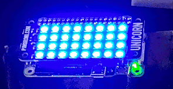
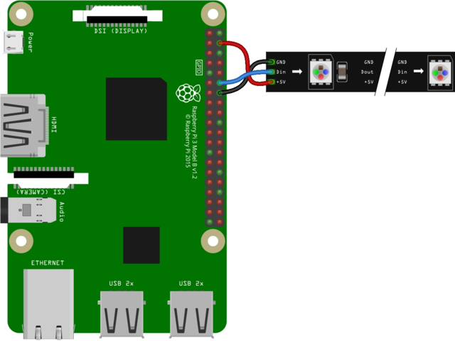
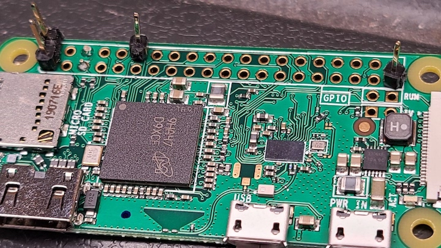
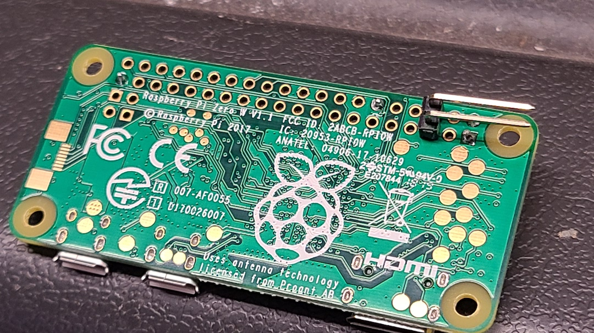
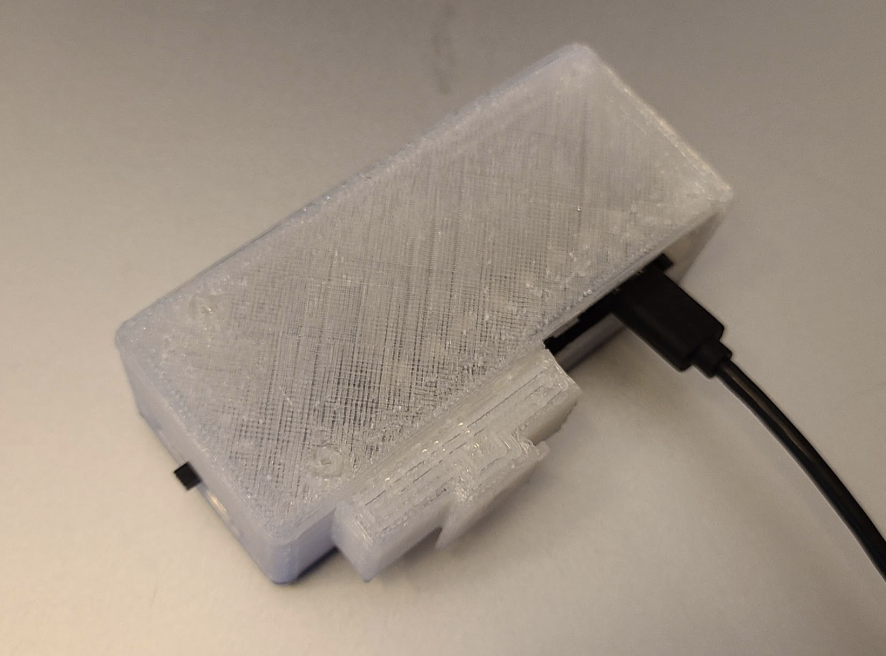
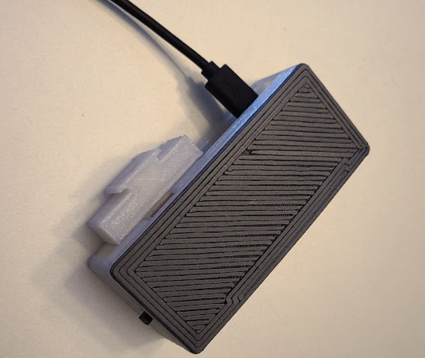

# Building the Tally Light Hardware

The TallyPi light was initially created around the
[Pimoroni Unicorn pHat](https://shop.pimoroni.com/products/unicorn-phat),
however has since been expanded to use the NeoPixels platform using the
[Adafruit Blinka library](https://github.com/adafruit/Adafruit_Blinka)
and the Raspberry Pi CircuitPython libraries. Both platforms continue to be
supported, however the default is now the NeoPixel driver.

Although some might consider it overkill, the main platform running the drivers
and powering the LEDs is suggested to be a
[Raspberry Pi Zero W](https://www.raspberrypi.org/products/raspberry-pi-zero-w/).
You can also print a custom enclosure to keep it all together and diffuse the
bright LED lights.

## Preparing an 5x10 PixelLeaf RGB Matrix

The 5x10 PixelLeaf RGB Matrix is a NeoPixel based breakout board
that follows the same setup & schematics as other NeoPixel boards.
The PixelLeaf peforms well when powered by the 5V GPIO pin on a
Raspberry Pi Zero W, even without level shifting, provided you use
a 2A USB power adapter.

If you follow the
[Powering NeoPixels from Raspberry Pi Without Level Shifting](https://learn.adafruit.com/neopixels-on-raspberry-pi/raspberry-pi-wiring#powering-neopixels-from-raspberry-pi-without-level-shifting-3006456-7)
guide on the Adafruit site, you find you only need to connect
pin #2 5v power, pin #12 GPIO18, and any ground pin to the PixelLeaf.

## Preparing a Unicorn pHat

The Unicorn pHat usually comes with an unsoldered header connector, which
requires some assembly.

Once the socketed header is soldered onto the pHat, a few pins need to be
soldered on the Pi Zero W. Not all the pins need to be soldered however -
note that the
[Unicorn pHat pinout diagram](https://pinout.xyz/pinout/unicorn_phat)
indicates only the pin #2 5v power, pin #12 GPIO18, and any ground pin
needs to be available. You can also solder additional pins for stability if
you like.

Personally I've had success in soldering pins 2, 12, and 39 for the pHat.

## Preparing the On/Off Switch

If you short pins 5 and 6 while the Pi is in HALT state, the
Raspberry Pi bootloader will jumpstart the OS and allow the Pi to boot.
In addition, the TallyPi service will monitor pins 5 and 6 to notice a
state change and initiate an operating system shutdown.

By connecting pins 5 and 6 to a button or a switch, you can easily create a
power on and off button or switch.

## Printing the Enclosure & Camera Mount

I created a (fairly ugly) enclosure for the TallyPi light, based on the
[Adafruit Pi Zero case](https://www.thingiverse.com/thing:1165227).
The enclosure height has been increased to make room for the Unicorn pHat,
the SD card and HDMI port have been closed off, and a camera flash mount has
been added. An open slot for a power switch is provided on the side of
the build.

The "front" part of the enclosure is intended to be printed with a transparent
or translucent material that will diffuse the bright pHat LEDs. It is intended
to enclose most of the hardware build, and allow camera operators as well as
foreground subjects to see the light's current state.

The "rear" part of the enclosure is more of a backplate that closes up the
entire enclosure. Not much to it. In the above image, I kept the raft on the
print just because it was printed at a lower resolution and a raft actually
looked better than the printed part...
